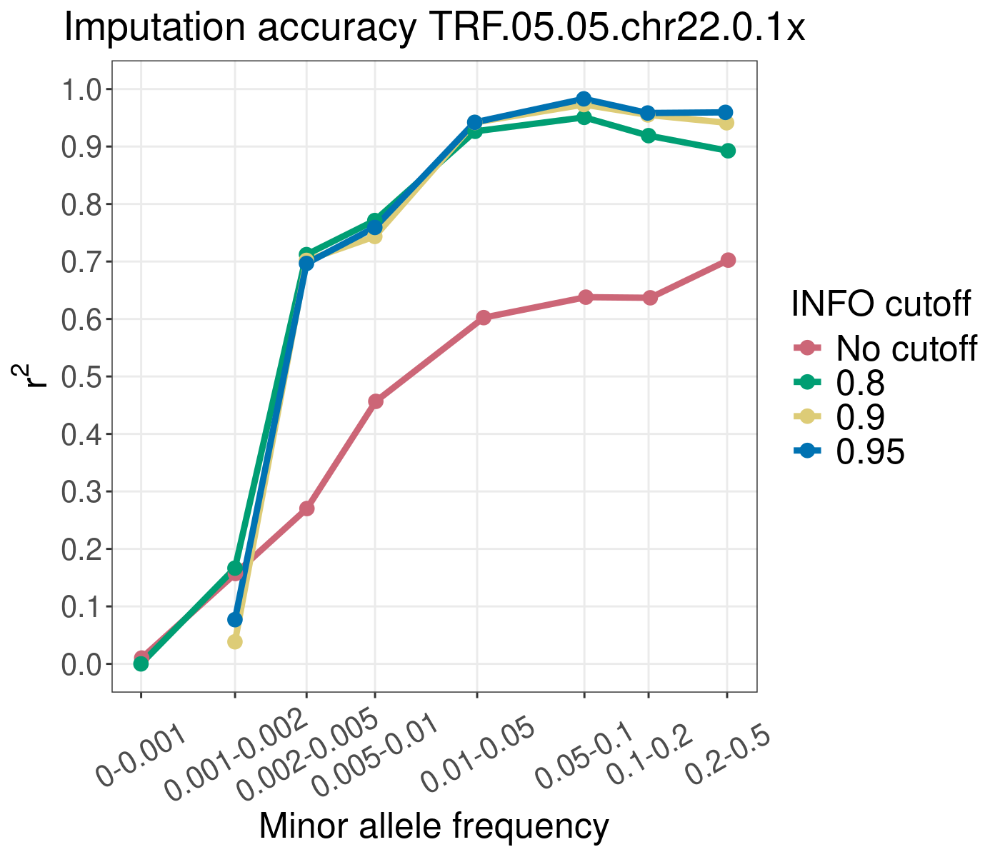
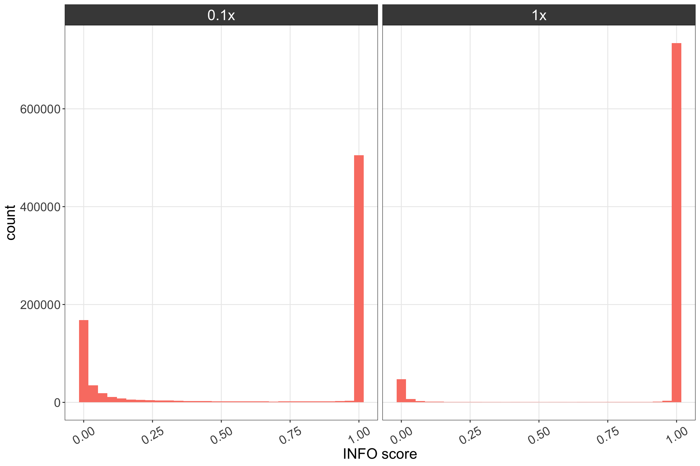
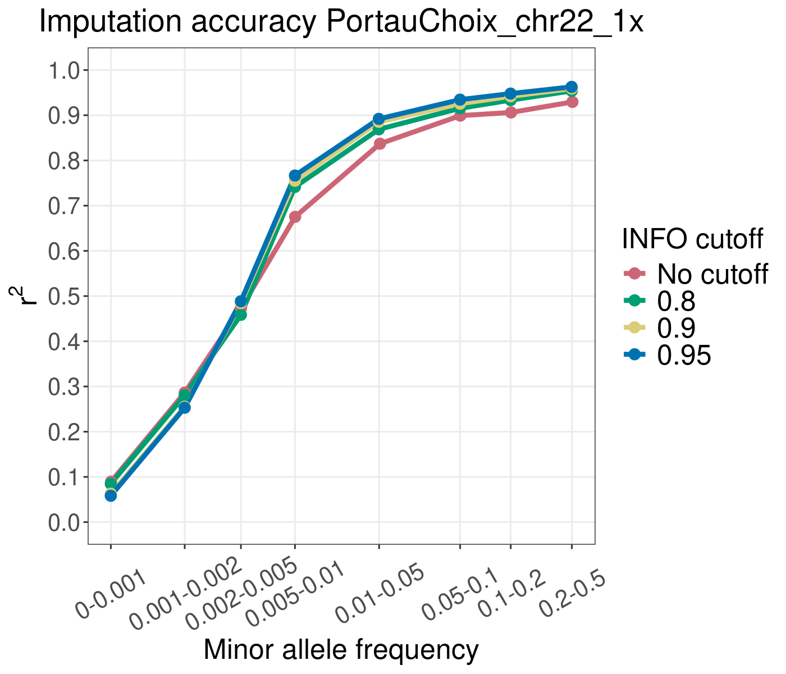
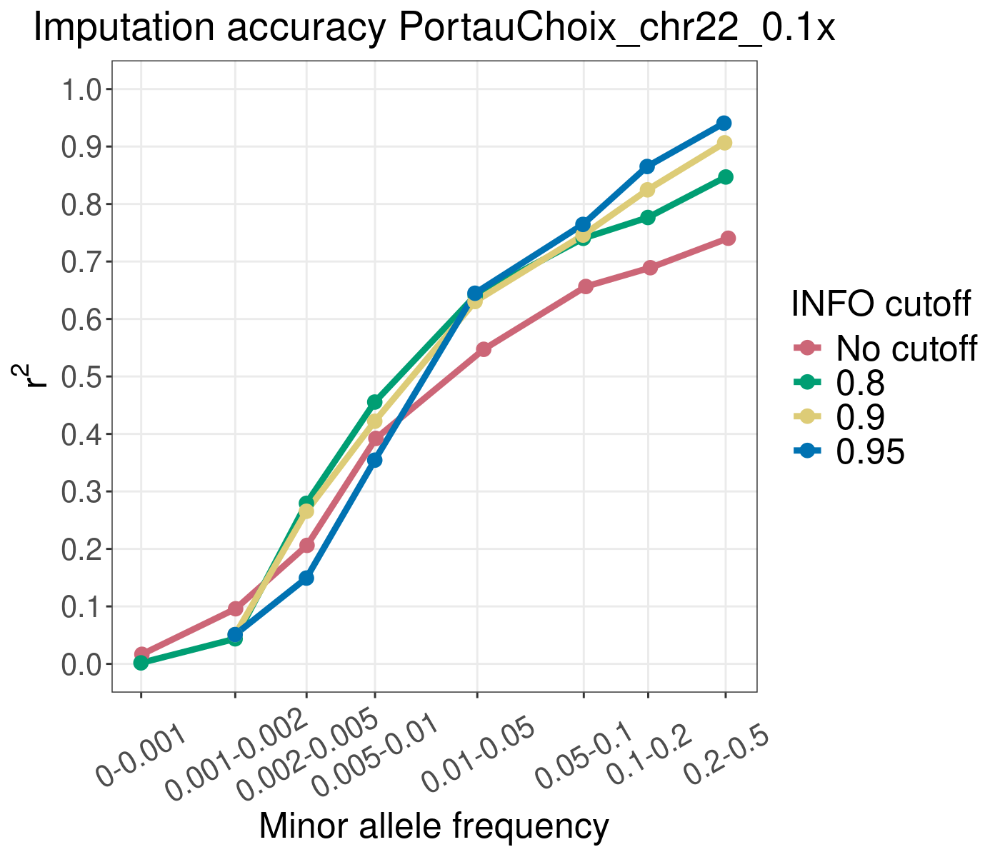

# aDNA_course_2025
Genotype imputation exercise for the 2025 aDNA course "Decoding the past: An introduction to ancient genomics"

### Introduction

This tutorial will show you how to run genotype imputation using GLIMPSE ([Rubinacci et al.,2021](https://doi.org/10.1038/s41588-020-00756-0)), an imputation and phasing method tailored for low coverage sequencing data. We will test imputation accuracy in an ancient dog from Siberia, dated to 2,000 years before present (ybp). This sample is relatively high coverage for ancient standards (11.8x), so in order to test the imputation accuracy, we will downsample it to lower coverages (0.1x and 1x) and see how the imputed genotypes compare to the "true" high coverage ones.

We will run GLIMPSE from sequencing reads data (BAM files) to obtain imputed and phased genotypes.

For this tutorial, we will focus only on chromosome 22.

### Activate interactive session
```
#first run:
salloc --account=teaching --reservation=aDNA_PHD_course --nodes=1 -D `pwd` --mem-per-cpu 15000 --ntasks-per-node=1 -t 1400

# once the node is allocated run this:
srun --pty -n 1 -c 1 bash -i
```

### Create directory
```
directoryImputation="/home/${USER}/Imputation/"
mkdir -p $directoryImputation
# go into the directory
cd $directoryImputation
```


### Set paths to data folder
```
COURSE_PATH=/projects/course_1
DATA_PATH=${COURSE_PATH}/people/qcj125/data_exercise
```

### Load required modules
Run the following bash script:  
```
. ${COURSE_PATH}/people/qcj125/activate.sh
```


## Exercise 1: Explore input data
We will use the following files:  
1) Reference panel  
2) Genetic (recombination) map  
3) Reference fasta file  
4) Ancient dog bam files  

### Reference panel
```
REF=${DATA_PATH}/reference_panel_vcf/ref-panel_chr22.vcf.gz
```

Let's take a look:  
```
bcftools view ${REF} | less -S
```

#### Questions: 
1) How many sites are in the panel for chr22?  
2) Are the sites phased?
3) How many samples are in the reference panel?  
4) What species are present?

#### Hints (use these commands to answer the above questions): 
```
bcftools view -H ${REF} | wc -l
bcftools view ${REF} | less -S
bcftools query -l ${REF} | wc -l
bcftools query -l ${REF} | less -S
```

### Bam files
These include the initial high coverage bam file and the downsampled ones to 1x and 0.1x coverage:
```
ls ${DATA_PATH}/bams/TRF.05.05_Merged.CanFam3.1Y.rmdup.bam
ls ${DATA_PATH}/bams_down/TRF.05.05.chr22.0.1x.bam
ls ${DATA_PATH}/bams_down/TRF.05.05.chr22.1x.bam
```

### Genetic map (recombination map)
```
MAP=${DATA_PATH}/gen_map/chr22_average_canFam3.1_modified.txt
```

Let's take a look:  
```
less ${MAP}
```

The three columns are genomic position, chromosome, and distance in cM.

#### Question: 
Why do you think we need a genetic map for imputation?

### Reference genome (fasta files)
```
REFGEN=${DATA_PATH}/reference_fasta/CanFam31_chr22.fasta
```

**Note!!!** It is important to make sure the reference panel samples and target samples have been mapped with the same reference genome, and that you use the correct one for imputation.


## Exercise 2: Imputing an ancient dog genome with GLIMPSE
We will now run different steps as part of the GLIMPSE imputation pipeline and impute the 1x ancient Siberian dog sample.

Make output directories (ONLY RUN THIS ONCE!)
```
mkdir -p output/reference_panel
mkdir -p output/GLs_target_bams
mkdir -p output/chunks
mkdir -p output/GLIMPSE_imputed
mkdir -p output/GLIMPSE_ligated
mkdir -p output/GLIMPSE_concordance
```

### Step 1: Extract variable positions from the reference panel  
The first step is to extract the list of variable sites from the reference panel in a tsv format, to be used downstream for computing genotype likelihoods in the ancient samples (see below)

The -G option drops individual genotype information (not needed at this step)
The -m 2 -M 2 -v snps retains biallelic snps

```
REF=${DATA_PATH}/reference_panel_vcf/ref-panel_chr22.vcf.gz
VCF=output/reference_panel/chr22_ref_panel_sites.vcf.gz

bcftools view \
-G -m 2 -M 2 -v snps \
${REF} \
-Oz -o ${VCF}

bcftools index -f ${VCF}
```

Get the chrom, pos, ref and alt fields for each site and put it into a new tsv file:
```
VCF=output/reference_panel/chr22_ref_panel_sites.vcf.gz
TSV=output/reference_panel/chr22_ref_panel_sites.tsv.gz

bcftools query -f'%CHROM\t%POS\t%REF,%ALT\n' \
${VCF} | \
bgzip -c > ${TSV}

tabix -s1 -b2 -e2 ${TSV}
```

Take a look at the vcf and tsv files from above:    
```
bcftools view output/reference_panel/chr22_ref_panel_sites.vcf.gz | less -S
```
```
less -S output/reference_panel/chr22_ref_panel_sites.tsv.gz
```


### Step 2: Compute genotype likelihoods at each position

#### Let's start with the 1x ancient Siberian dog
```
SAMPLE=TRF.05.05.chr22.1x
```

The bcftools mpileup command generates a VCF containing genotype likelihoods for a bam file at specified sites. Then bcftools call uses the genotype likelihoods to infer genotypes.

```
BAM=${DATA_PATH}/bams_down/${SAMPLE}.bam
VCF=output/reference_panel/chr22_ref_panel_sites.vcf.gz
TSV=output/reference_panel/chr22_ref_panel_sites.tsv.gz
REFGEN=${DATA_PATH}/reference_fasta/CanFam31_chr22.fasta
GL=output/GLs_target_bams/${SAMPLE}.vcf.gz

bcftools mpileup \
-f ${REFGEN} \
-I -E -a 'FORMAT/DP' \
-T ${VCF} \
-r chr22 ${BAM} -Ou | \
bcftools call \
-Aim \
-C alleles \
-T ${TSV} \
-Oz -o ${GL} \
--threads 6

bcftools index -f ${GL}


# bcftools mpileup options:
# -f ${REFGEN} Reference genome in a fasta file
# -I Ignore indels
# -E Recalculate BAQ on the fly, ignore existing BQ tags
# -a 'FORMAT/DP' Annotate per-sample read depth in the FORMAT field (DP).
# -T ${VCF} Sites file
#
# bcftools call options:
# -Aim A: Keep all alternative sites, i: output also sites missed by mpileup but present in -T, m: alternative model for multiallelic and rare-variant calling 
# -C alleles Call genotypes given the alleles in the TSV file below
# -T TSV file with the allowed alleles list 
```

### Step 3: Splitting each chromosome into chunks  
Glimpse has a tool (GLIMPSE_chunk) which splits the chromosome into "chunks" to run the imputation and phasing on each.

```
VCF=output/reference_panel/chr22_ref_panel_sites.vcf.gz
CHUNK=output/chunks/chr22_chunks.txt

GLIMPSE_chunk_static \
--input ${VCF} \
--region chr22 \
--window-size 2000000 --buffer-size 200000 \
--output ${CHUNK}

# --window-size Defines the size of the main genomic segment (in base pairs) that GLIMPSE will impute at once
# --buffer-size Adds extra flanking sequence around each window to account for edge effects
```

### Step 4: Impute! For each of the chunks estimated from above, impute using the genotype likelihoods 

```
GL=output/GLs_target_bams/${SAMPLE}.vcf.gz
REF_PANEL=${DATA_PATH}/reference_panel_vcf/ref-panel_chr22.vcf.gz
MAP=${DATA_PATH}/gen_map/chr22_average_canFam3.1_modified.txt
CHUNK=output/chunks/chr22_chunks.txt
OUT=output/GLIMPSE_imputed/${SAMPLE}.${ID}.bcf
PREFIX=output/GLIMPSE_imputed/${SAMPLE}

while IFS="" read -r LINE || [ -n "${LINE}" ];
do
  printf -v ID "%02d" $(echo ${LINE} | cut -d" " -f1)
  IRG=$(echo ${LINE} | cut -d" " -f3)
  ORG=$(echo ${LINE} | cut -d" " -f4)
  OUT=${PREFIX}.${ID}.bcf
  GLIMPSE_phase_static --input ${GL} \
  --reference ${REF_PANEL} \
  --map ${MAP} \
  --input-region ${IRG} \
  --output-region ${ORG} --output ${OUT} \
  --thread 2
  bcftools index -f ${OUT}
done < ${CHUNK}
```

Take a small break while this is running :)


### Step 5: Ligate the chunks together
After imputing, we can now merge all of the imputed sites for each chunk together, using the GLIMPSE_ligate tool:

```
#make list with file names to merge:
LIST=output/GLIMPSE_ligated/list.chr22.txt
ls output/GLIMPSE_imputed/${SAMPLE}.*.bcf > ${LIST}

LIGATED=output/GLIMPSE_ligated/${SAMPLE}.ligated.bcf

GLIMPSE_ligate_static \
--input ${LIST} \
--output ${LIGATED}

bcftools index -f ${LIGATED}
```

### Step 6: Phase the whole chromosome using the GLIMPSE_sample tool. 
We will use the mode which outputs the most likely haplotypes given the values in the FORMAT/HS field. (What is the HS field?)

```
LIGATED=output/GLIMPSE_ligated/${SAMPLE}.ligated.bcf
PHASED=output/GLIMPSE_ligated/${SAMPLE}.phased.bcf

GLIMPSE_sample_static \
--input ${LIGATED} \
--solve \
--output ${PHASED}

bcftools index -f ${PHASED}
```

### Step 7: Annotate the phased files (some fields are not carried over from the imputed to the phased files)
```
LIGATED=output/GLIMPSE_ligated/${SAMPLE}.ligated.bcf
PHASED=output/GLIMPSE_ligated/${SAMPLE}.phased.bcf
ANNOTATED=output/GLIMPSE_ligated/${SAMPLE}.phased_annotated.vcf.gz

bcftools annotate \
${PHASED} \
--annotation ${LIGATED} \
--columns FORMAT/DS,FORMAT/GP,FORMAT/HS \
--output-type z \
--output ${ANNOTATED}

bcftools index --tbi ${ANNOTATED}
```

#### Congrats, you have now imputed and phased an ancient dog sample!

Let's take a look at the final phased and imputed file:
```
bcftools view output/GLIMPSE_ligated/${SAMPLE}.phased_annotated.vcf.gz | less -S
```

Take a moment to understand the different fields. What does the INFO/INFO field represent?

Question:  
How many imputed sites are there? How does it compare the number of sites in the reference panel?

#### Hint (use this command to answer the above questions): 
```
bcftools view -H output/GLIMPSE_ligated/${SAMPLE}.phased_annotated.vcf.gz | wc -l
```


## Exercise 3: Checking imputation accuracy

### Let's take a look at how accurate the imputation is!

Since our ancient dog sample is "high coverage", we can use the genotypes from it as the "true genotypes", and compare them to the imputed genotypes. This will give us an idea of how accurate the imputation went.

You can find the "true genotypes" here:


Luckily, GLIMPSE has an additional tool called GLIMPSE_concordance, which can do this for us.

But first, let's come back to the INFO/INFO field we saw above. This field essentially indicates the level of uncertainty in the posterior genotypes probabilities of each imputed site. The closer to 1, the more certain we are about that imputed site. As we saw in the previous exercise, all the sites present in the reference panel will also be imputed in the ancient sample. However, this does not mean that every imputed site will be correct. Therefore, it's a good approach to filter out low-confidence imputed site based on the INFO score. Let's do that for 3 different INFO score cutoffs: 0.8, 0.9, 0.95. The higher the cutoff, the more strict we are, and the more sites are filtered out.

```
ANNOTATED=output/GLIMPSE_ligated/${SAMPLE}.phased_annotated.vcf.gz

for i in 0 0.8 0.9 0.95
do
bcftools view \
${ANNOTATED} \
--include "INFO/INFO >= ${i}" \
-Ob -o output/GLIMPSE_ligated/${SAMPLE}.phased_annotated_INFO_${i}.bcf

bcftools index -f output/GLIMPSE_ligated/${SAMPLE}.phased_annotated_INFO_${i}.bcf

done
```

What we need for GLIMPSE_concordance is a file with the sample name and a file containing the following information:
1) The chromosome (or region) we're interested in
2) A file with the allele frequencies at each site (this is in the reference panel)
3) The "true genotypes" from the high coverage ancient sample
4) The imputed data

Make file with sample name:
```
ANNOTATED=output/GLIMPSE_ligated/${SAMPLE}.phased_annotated.vcf.gz
SAMPLE_NAME=output/GLIMPSE_concordance/${SAMPLE}.txt

bcftools query -l ${ANNOTATED} > ${SAMPLE_NAME}
```

Make file with required inputs:
```
REF=${DATA_PATH}/reference_panel_vcf/ref-panel_chr22.vcf.gz
TRUE=${DATA_PATH}/validation_bams/TRF.05.05_chr22_validation_filt_qual_dp_ab.bcf

for i in 0 0.8 0.9 0.95
do
echo "chr22" ${REF} ${TRUE} output/GLIMPSE_ligated/${SAMPLE}.phased_annotated_INFO_${i}.bcf > output/GLIMPSE_concordance/lst_${SAMPLE}_INFO_${i}.txt
done
```

Run GLIMPSE_concordance for our imputed sample, using the different INFO score cutoffs. This will take a few minutes.
```
LST=output/GLIMPSE_concordance/lst_${SAMPLE}_INFO_${i}.txt
SAMPLE_NAME=output/GLIMPSE_concordance/${SAMPLE}.txt

for i in 0 0.8 0.9 0.95
do
GLIMPSE_concordance_static \
--input output/GLIMPSE_concordance/lst_${SAMPLE}_INFO_${i}.txt \
--minDP 8 \
--output output/GLIMPSE_concordance/${SAMPLE}_INFO_${i} \
--minPROB 0.9 \
--bins 0.00000 0.00100 0.00200 0.00500 0.01000 0.05000 0.10000 0.20000 0.50000 \
--sample ${SAMPLE_NAME} \
--af-tag AF
done
```

Now there are different output files produced at this step, but let's focus on the one finishing in "rsquare.grp.txt.gz": 
```
ls output/GLIMPSE_concordance/${SAMPLE}_INFO_*.rsquare.grp.txt.gz
```

This file has 5 columns, but we're interested in the 1st (MAF bin number) and last (aggregative r^2). We'll use these two columns to plot the imputation accuracy.

#### Plot imputation accuracy at 1x coverage across different INFO cutoffs

```
Rscript ${DATA_PATH}/scripts/glimpse_accuracy.R ${SAMPLE}
```

In order to download the figure from the server to your local machine, run this command (remember to change it to your own username!!!)
```
scp qcj125@mjolnirgate.unicph.domain:/home/qcj125/Imputation/TRF.05.05.chr22.1x_imputation_accuracy.png .
```

Questions: 
1) What do you notice from this plot about the different INFO score cutoffs?
2) What do you notice about the different MAF bins? Would you apply a MAF cutodff? Why?


## Exercise 4: Checking imputation accuracy at 0.1x

If you have time, re-run the imputation steps 2-7, this time using the 0.1x downsampled dog (Change the SAMPLE name from TRF.05.05.chr22.1x to TRF.05.05.chr22.0.1x in Step 2, and then re-run the following steps as is). 

Then plot the results:
```
Rscript ${DATA_PATH}/scripts/glimpse_accuracy.R ${SAMPLE}
```

If you don't have time to run the 0.1x sample, you can find the plot showing the imputation accuracy here: 



Questions:  
What differences do you notice between the 1x and 0.1x imputed samples? Why? 

Let's look at the distribution of INFO scores for 1x and 0.1x:



Question:
What difference do you notice in the INFO scores between the two coverages? How does this relate to the accuracy results?

Another thing to keep in mind, is how many sites you're retaining after post-imputation filtering.

Let's see how many are left after filtering for different INFO scores for the two tested coverages:
```
# For 1x coverage:
bcftools view -H output/GLIMPSE_ligated/TRF.05.05.chr22.1x.phased_annotated_INFO_0.bcf | wc -l
bcftools view -H output/GLIMPSE_ligated/TRF.05.05.chr22.1x.phased_annotated_INFO_0.8.bcf | wc -l
bcftools view -H output/GLIMPSE_ligated/TRF.05.05.chr22.1x.phased_annotated_INFO_0.9.bcf | wc -l
bcftools view -H output/GLIMPSE_ligated/TRF.05.05.chr22.1x.phased_annotated_INFO_0.95.bcf | wc -l

# For 0.1x coverage
bcftools view -H output/GLIMPSE_ligated/TRF.05.05.chr22.0.1x.phased_annotated_INFO_0.bcf | wc -l
bcftools view -H output/GLIMPSE_ligated/TRF.05.05.chr22.0.1x.phased_annotated_INFO_0.8.bcf | wc -l
bcftools view -H output/GLIMPSE_ligated/TRF.05.05.chr22.0.1x.phased_annotated_INFO_0.9.bcf | wc -l
bcftools view -H output/GLIMPSE_ligated/TRF.05.05.chr22.0.1x.phased_annotated_INFO_0.95.bcf | wc -l
```
Question:
1) How does the number of retained sites vary between different coverages and INFO score cutoffs?
2) Would you impute a really low coverage sample (say 0.01x) and apply an INFO score filter?

## Exercise 5: Impact of ancestral representation in the reference panel

Since imputation relies on the haplotypes present in the reference panel, we would expect that the representation of ancestries among the samples in the panel will impact the imputation accuracy. Ideally, we will have the ancestry of our target sample also present among the reference panel haplotypes. 

Let's impute a different ancient dog sample, from North America dated to ~4,000 ybp. This is a pre-contact American dog, a lineage that existed in the Americas which rapidly disappeared following the arrival of European settlers, leaving minimal trace in present-day dogs.   

All the imputation steps have already been run, and we're ready to plot the accuracy:

Plot for 1x coverage:


Plot for 0.1x coverage:



Question: 
1) How does the accuracy of the ancient North American dog compare to that of the ancient Siberian dog? Why do you think that is?
2) Would you impute low coverage ancient North American pre-contact dogs? 


